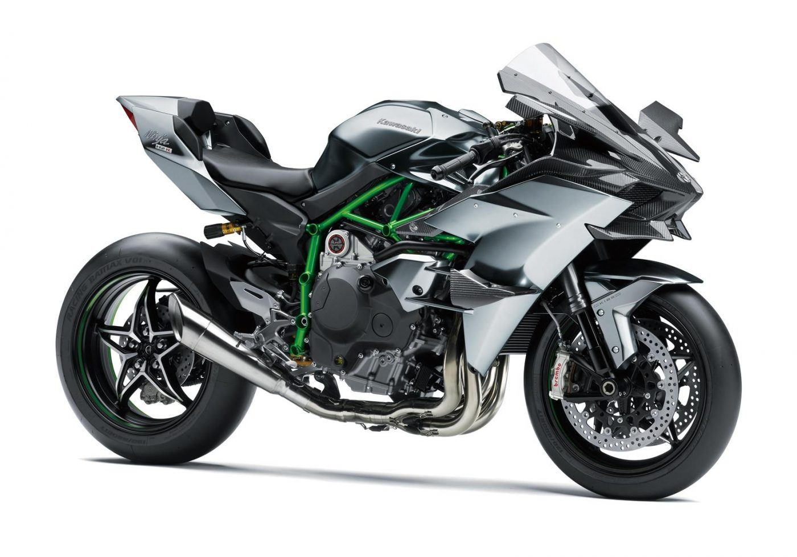

Our first markdown file

# Heading 1
## Heading 2
### Heading 3
#### Heading 4
##### Heading 5
###### Heading 6
**Bold Text**

__Bold Text ki Ninja Technique__

*Italic*

~~Striked through text~~

`highliting`

**Hello I am *Hardeep* *Ijardar***

url redirecting
[click here](https://ollama.com/)

[click here for image](food.jpg)


[](https://www.kawasaki-india.com/wp-content/uploads/2017/12/19ZX1000Y_201GY3DRF1CG_A.jpg)


> Videos can't be displayed but to display convert it to gif and then display the gif file as it takes gif file as an image


## Cafes in Vadodara
- The Brewry

    1.  Fish and Chips
        * bnv
    2. Truffle cake
- Koa Cafe
- Artistry Cafe
+ Cleo's Coffee and Mohito

## Conversion Chart
|Sr no|From|To|Conversion rate|
|-----:|:----|--:|-----------|
|1.|India|Canada|1 CAD = 60.0699 INR\||
|2.|America|China|1 CNY = 0.137916 USD|


# Code BLocks

```py
for i in range(10):
    print(i)
```

```js
console.log("Hello")
a = 10
b = 20
console.log(a+b)

```
> This is a work inspired by Pratik 500😂😂

- [ ] Work
- [x] Work
- [X] Work

^[Hardeep Ijardar]

<!--comment-->
